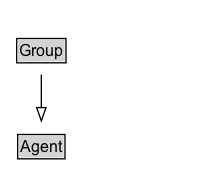

# Group

## Diagram

=== "SVG (interactive)"

    <!-- Generated by graphviz version 14.0.2 (20251019.1705)
     -->
    <!-- Pages: 1 -->
    <svg width="150pt" height="132pt"
     viewBox="0.00 0.00 150.00 132.00" xmlns="http://www.w3.org/2000/svg" xmlns:xlink="http://www.w3.org/1999/xlink">
    <g id="graph0" class="graph" transform="scale(1 1) rotate(0) translate(4 128)">
    <polygon fill="white" stroke="none" points="-4,4 -4,-128 146,-128 146,4 -4,4"/>
    <g id="clust2" class="cluster">
    <title>cluster_associated</title>
    </g>
    <!-- Group -->
    <g id="node1" class="node">
    <title>Group</title>
    <g id="a_node1"><a xlink:href="../Group" xlink:title="&lt;TABLE&gt;">
    <polygon fill="lightgray" stroke="none" points="9.5,-81.88 9.5,-98.12 44.5,-98.12 44.5,-81.88 9.5,-81.88"/>
    <text xml:space="preserve" text-anchor="start" x="10.5" y="-85.72" font-family="Arial" font-size="12.00">Group</text>
    <polygon fill="none" stroke="black" points="8.5,-80.88 8.5,-99.12 45.5,-99.12 45.5,-80.88 8.5,-80.88"/>
    </a>
    </g>
    </g>
    <!-- Agent -->
    <g id="node3" class="node">
    <title>Agent</title>
    <g id="a_node3"><a xlink:href="../Agent" xlink:title="&lt;TABLE&gt;">
    <polygon fill="lightgray" stroke="none" points="10.25,-9.88 10.25,-26.12 43.75,-26.12 43.75,-9.88 10.25,-9.88"/>
    <text xml:space="preserve" text-anchor="start" x="11.25" y="-13.72" font-family="Arial" font-size="12.00">Agent</text>
    <polygon fill="none" stroke="black" points="9.25,-8.88 9.25,-27.12 44.75,-27.12 44.75,-8.88 9.25,-8.88"/>
    </a>
    </g>
    </g>
    <!-- Group&#45;&gt;Agent -->
    <g id="edge1" class="edge">
    <title>Group&#45;&gt;Agent</title>
    <path fill="none" stroke="black" d="M27,-72.05C27,-64.57 27,-55.58 27,-47.14"/>
    <polygon fill="none" stroke="black" points="30.5,-47.3 27,-37.3 23.5,-47.3 30.5,-47.3"/>
    </g>
    <!-- Invis -->
    </g>
    </svg>

=== "PNG"

    

## Formalization for Group

| Property | Constraint |
|----------|------------|
| subClassOf | [Agent](Agent.md) |

## Other annotations

| Property | Value |
|----------|-------|
| [vs:term_status](https://w3id.org/citydata/imported/vs/term_status) | stable |

