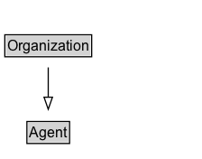

# Organization

## Diagram

=== "SVG (interactive)"

    <!-- Generated by graphviz version 14.0.2 (20251019.1705)
     -->
    <!-- Pages: 1 -->
    <svg width="168pt" height="132pt"
     viewBox="0.00 0.00 168.00 132.00" xmlns="http://www.w3.org/2000/svg" xmlns:xlink="http://www.w3.org/1999/xlink">
    <g id="graph0" class="graph" transform="scale(1 1) rotate(0) translate(4 128)">
    <polygon fill="white" stroke="none" points="-4,4 -4,-128 164.12,-128 164.12,4 -4,4"/>
    <g id="clust2" class="cluster">
    <title>cluster_associated</title>
    </g>
    <!-- Organization -->
    <g id="node1" class="node">
    <title>Organization</title>
    <g id="a_node1"><a xlink:href="../Organization" xlink:title="&lt;TABLE&gt;">
    <polygon fill="lightgray" stroke="none" points="1,-81.88 1,-98.12 71.25,-98.12 71.25,-81.88 1,-81.88"/>
    <text xml:space="preserve" text-anchor="start" x="2" y="-85.72" font-family="Arial" font-size="12.00">Organization</text>
    <polygon fill="none" stroke="black" points="0,-80.88 0,-99.12 72.25,-99.12 72.25,-80.88 0,-80.88"/>
    </a>
    </g>
    </g>
    <!-- Agent -->
    <g id="node3" class="node">
    <title>Agent</title>
    <g id="a_node3"><a xlink:href="../Agent" xlink:title="&lt;TABLE&gt;">
    <polygon fill="lightgray" stroke="none" points="19.38,-9.88 19.38,-26.12 52.88,-26.12 52.88,-9.88 19.38,-9.88"/>
    <text xml:space="preserve" text-anchor="start" x="20.38" y="-13.72" font-family="Arial" font-size="12.00">Agent</text>
    <polygon fill="none" stroke="black" points="18.38,-8.88 18.38,-27.12 53.88,-27.12 53.88,-8.88 18.38,-8.88"/>
    </a>
    </g>
    </g>
    <!-- Organization&#45;&gt;Agent -->
    <g id="edge1" class="edge">
    <title>Organization&#45;&gt;Agent</title>
    <path fill="none" stroke="black" d="M36.12,-72.05C36.12,-64.57 36.12,-55.58 36.12,-47.14"/>
    <polygon fill="none" stroke="black" points="39.63,-47.3 36.13,-37.3 32.63,-47.3 39.63,-47.3"/>
    </g>
    <!-- Invis -->
    </g>
    </svg>

=== "PNG"

    

## Formalization for Organization

| Property | Constraint |
|----------|------------|
| disjointWith | [Person](Person.md) |
| disjointWith | [Document](Document.md) |
| subClassOf | [Agent](Agent.md) |

## Other annotations

| Property | Value |
|----------|-------|
| [vs:term_status](https://w3id.org/citydata/imported/vs/term_status) | stable |

