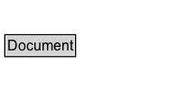

# Document

## Diagram

=== "SVG (interactive)"

    <!-- Generated by graphviz version 14.1.3 (20260303.0454)
     -->
    <!-- Pages: 1 -->
    <svg width="154pt" height="76pt"
     viewBox="0.00 0.00 154.00 76.00" xmlns="http://www.w3.org/2000/svg" xmlns:xlink="http://www.w3.org/1999/xlink">
    <g id="graph0" class="graph" transform="scale(1 1) rotate(0) translate(4 72)">
    <polygon fill="white" stroke="none" points="-4,4 -4,-72 150.38,-72 150.38,4 -4,4"/>
    <g id="clust3" class="cluster">
    <title>cluster_associated</title>
    </g>
    <!-- Document -->
    <g id="node1" class="node">
    <title>Document</title>
    <g id="a_node1"><a xlink:href="../Document" xlink:title="&lt;TABLE&gt;">
    <polygon fill="lightgray" stroke="none" points="1,-25.88 1,-42.12 57.75,-42.12 57.75,-25.88 1,-25.88"/>
    <text xml:space="preserve" text-anchor="start" x="2" y="-29.88" font-family="Arial" font-size="12.00">Document</text>
    <polygon fill="none" stroke="black" points="0,-24.88 0,-43.12 58.75,-43.12 58.75,-24.88 0,-24.88"/>
    </a>
    </g>
    </g>
    <!-- Invis -->
    </g>
    </svg>

=== "PNG"

    

## Specializations of Document

| Class | Description |
|-------|-------------|
| [Image](Image.md) |  |
| [Personal Profile Document](PersonalProfileDocument.md) |  |

## Formalization for Document

| Property | Constraint |
|----------|------------|
| disjointWith | [Organization](Organization.md) |
| disjointWith | [Project](Project.md) |

## Other annotations

| Property | Value |
|----------|-------|
| [vs:term_status](https://w3id.org/citydata/imported/vs/term_status) | stable |

