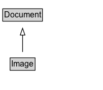

# Image

## Diagram

=== "SVG (interactive)"

    <!-- Generated by graphviz version 14.1.3 (20260303.0454)
     -->
    <!-- Pages: 1 -->
    <svg width="152pt" height="132pt"
     viewBox="0.00 0.00 152.00 132.00" xmlns="http://www.w3.org/2000/svg" xmlns:xlink="http://www.w3.org/1999/xlink">
    <g id="graph0" class="graph" transform="scale(1 1) rotate(0) translate(4 128)">
    <polygon fill="white" stroke="none" points="-4,4 -4,-128 148.38,-128 148.38,4 -4,4"/>
    <g id="clust3" class="cluster">
    <title>cluster_associated</title>
    </g>
    <!-- Document -->
    <g id="node1" class="node">
    <title>Document</title>
    <g id="a_node1"><a xlink:href="../Document" xlink:title="&lt;TABLE&gt;">
    <polygon fill="lightgray" stroke="none" points="1,-97.88 1,-114.12 57.75,-114.12 57.75,-97.88 1,-97.88"/>
    <text xml:space="preserve" text-anchor="start" x="2" y="-101.88" font-family="Arial" font-size="12.00">Document</text>
    <polygon fill="none" stroke="black" points="0,-96.88 0,-115.12 58.75,-115.12 58.75,-96.88 0,-96.88"/>
    </a>
    </g>
    </g>
    <!-- Image -->
    <g id="node2" class="node">
    <title>Image</title>
    <g id="a_node2"><a xlink:href="../Image" xlink:title="&lt;TABLE&gt;">
    <polygon fill="lightgray" stroke="none" points="11.88,-25.88 11.88,-42.12 46.88,-42.12 46.88,-25.88 11.88,-25.88"/>
    <text xml:space="preserve" text-anchor="start" x="12.88" y="-29.88" font-family="Arial" font-size="12.00">Image</text>
    <polygon fill="none" stroke="black" points="10.88,-24.88 10.88,-43.12 47.88,-43.12 47.88,-24.88 10.88,-24.88"/>
    </a>
    </g>
    </g>
    <!-- Image&#45;&gt;Document -->
    <g id="edge1" class="edge">
    <title>Image&#45;&gt;Document</title>
    <path fill="none" stroke="black" d="M29.38,-51.79C29.38,-59.25 29.38,-68.24 29.38,-76.69"/>
    <polygon fill="none" stroke="black" points="25.88,-76.54 29.38,-86.54 32.88,-76.54 25.88,-76.54"/>
    </g>
    <!-- Invis -->
    </g>
    </svg>

=== "PNG"

    

## Formalization for Image

| Property | Constraint |
|----------|------------|
| subClassOf | [Document](Document.md) |

## Other annotations

| Property | Value |
|----------|-------|
| [vs:term_status](https://w3id.org/citydata/imported/vs/term_status) | stable |

