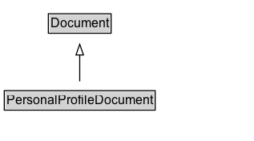

# PersonalProfileDocument

## Diagram

=== "SVG (interactive)"

    <!-- Generated by graphviz version 14.1.3 (20260303.0454)
     -->
    <!-- Pages: 1 -->
    <svg width="238pt" height="132pt"
     viewBox="0.00 0.00 238.00 132.00" xmlns="http://www.w3.org/2000/svg" xmlns:xlink="http://www.w3.org/1999/xlink">
    <g id="graph0" class="graph" transform="scale(1 1) rotate(0) translate(4 128)">
    <polygon fill="white" stroke="none" points="-4,4 -4,-128 233.62,-128 233.62,4 -4,4"/>
    <g id="clust3" class="cluster">
    <title>cluster_associated</title>
    </g>
    <!-- Document -->
    <g id="node1" class="node">
    <title>Document</title>
    <g id="a_node1"><a xlink:href="../Document" xlink:title="&lt;TABLE&gt;">
    <polygon fill="lightgray" stroke="none" points="42.25,-97.88 42.25,-114.12 99,-114.12 99,-97.88 42.25,-97.88"/>
    <text xml:space="preserve" text-anchor="start" x="43.25" y="-101.88" font-family="Arial" font-size="12.00">Document</text>
    <polygon fill="none" stroke="black" points="41.25,-96.88 41.25,-115.12 100,-115.12 100,-96.88 41.25,-96.88"/>
    </a>
    </g>
    </g>
    <!-- PersonalProfileDocument -->
    <g id="node2" class="node">
    <title>PersonalProfileDocument</title>
    <g id="a_node2"><a xlink:href="../PersonalProfileDocument" xlink:title="&lt;TABLE&gt;">
    <polygon fill="lightgray" stroke="none" points="1,-25.88 1,-42.12 140.25,-42.12 140.25,-25.88 1,-25.88"/>
    <text xml:space="preserve" text-anchor="start" x="2" y="-29.88" font-family="Arial" font-size="12.00">PersonalProfileDocument</text>
    <polygon fill="none" stroke="black" points="0,-24.88 0,-43.12 141.25,-43.12 141.25,-24.88 0,-24.88"/>
    </a>
    </g>
    </g>
    <!-- PersonalProfileDocument&#45;&gt;Document -->
    <g id="edge1" class="edge">
    <title>PersonalProfileDocument&#45;&gt;Document</title>
    <path fill="none" stroke="black" d="M70.62,-51.79C70.62,-59.25 70.62,-68.24 70.62,-76.69"/>
    <polygon fill="none" stroke="black" points="67.13,-76.54 70.63,-86.54 74.13,-76.54 67.13,-76.54"/>
    </g>
    <!-- Invis -->
    </g>
    </svg>

=== "PNG"

    

## Formalization for PersonalProfileDocument

| Property | Constraint |
|----------|------------|
| subClassOf | [Document](Document.md) |

## Other annotations

| Property | Value |
|----------|-------|
| [vs:term_status](https://w3id.org/citydata/imported/vs/term_status) | testing |

