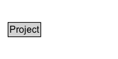

# Project

## Diagram

=== "SVG (interactive)"

    <!-- Generated by graphviz version 14.1.3 (20260303.0454)
     -->
    <!-- Pages: 1 -->
    <svg width="150pt" height="76pt"
     viewBox="0.00 0.00 150.00 76.00" xmlns="http://www.w3.org/2000/svg" xmlns:xlink="http://www.w3.org/1999/xlink">
    <g id="graph0" class="graph" transform="scale(1 1) rotate(0) translate(4 72)">
    <polygon fill="white" stroke="none" points="-4,4 -4,-72 146,-72 146,4 -4,4"/>
    <g id="clust3" class="cluster">
    <title>cluster_associated</title>
    </g>
    <!-- Project -->
    <g id="node1" class="node">
    <title>Project</title>
    <g id="a_node1"><a xlink:href="../Project" xlink:title="&lt;TABLE&gt;">
    <polygon fill="lightgray" stroke="none" points="7.25,-25.88 7.25,-42.12 46.75,-42.12 46.75,-25.88 7.25,-25.88"/>
    <text xml:space="preserve" text-anchor="start" x="8.25" y="-29.88" font-family="Arial" font-size="12.00">Project</text>
    <polygon fill="none" stroke="black" points="6.25,-24.88 6.25,-43.12 47.75,-43.12 47.75,-24.88 6.25,-24.88"/>
    </a>
    </g>
    </g>
    <!-- Invis -->
    </g>
    </svg>

=== "PNG"

    

## Formalization for Project

| Property | Constraint |
|----------|------------|
| disjointWith | [Person](Person.md) |
| disjointWith | [Document](Document.md) |

## Other annotations

| Property | Value |
|----------|-------|
| [vs:term_status](https://w3id.org/citydata/imported/vs/term_status) | testing |

